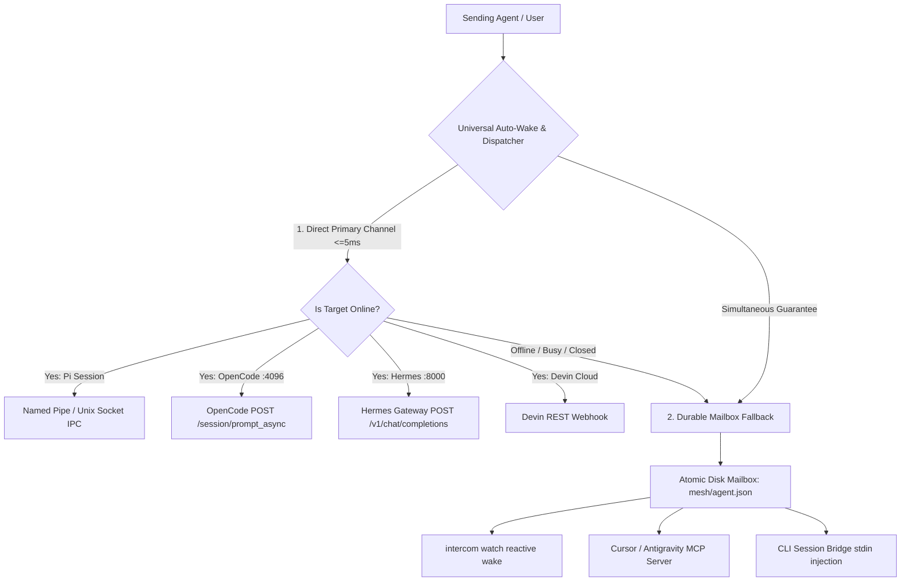

# 🛡️ Architecture & Resilience Guide: Defense-in-Depth Multi-Agent Coordination

`intercom-global` implements a **Defense-in-Depth & Zero-Loss Delivery** architecture designed for multi-agent systems where agents operate across heterogeneous environments (Terminals, IDEs, Web GUIs, Background Daemons, and Cloud VMs).

---

## 1. Defense-in-Depth Delivery Hierarchy (Graceful Degradation)



### Layer 1: Primary Direct IPC / REST Channel (<=5ms)
* **Named Pipe / Unix Domain Socket**: Direct native length-prefixed JSON framing with background auto-spawning broker for Pi Coding Agent.
* **Local REST Injections**:
  * **OpenCode Agent** (`http://127.0.0.1:4096`): Direct `POST /session/:sessionID/prompt_async` triggers.
  * **Hermes Agent** (`http://127.0.0.1:8000`): Direct `POST /v1/chat/completions` triggers.
* **Benefit**: When the agent process is actively running, it receives the turn signal in <=5ms with zero polling overhead.

### Layer 2: Durable Fallback Mailbox (Zero-Loss Guarantee)
* If an agent's process is busy, paused, closed, or restarting, tasks are never dropped.
* Every dispatched task is written using **atomic file rename semantics** (`.tmp` -> `.json`) to `mesh/<agent>.json`.
* When the agent starts up or checks in, it instantly consumes all pending tasks in order.

---

## 2. Heterogeneous Tooling Compatibility Matrix

| Runtime Model | Tools / Agents | Primary Transport | Waking & Execution Hook |
| :--- | :--- | :--- | :--- |
| **Interactive TUI / CLI** | OpenCode, Hermes Agent, Aider | `stdin` Injection & Local REST | `intercom bridge --agent <name> -- <cli>` or REST API |
| **IDE / Extension** | Cursor, Windsurf, VS Code (Cline, Roo), Antigravity | Model Context Protocol (MCP) & File Watcher | `intercom-mcp` (Stdio isolation) or `intercom watch` |
| **Native Multi-Session** | Pi Coding Agent (`pi-intercom`) | Windows Named Pipes / Unix Sockets | Native binary framing with auto-broker spawn |
| **Autonomous Cloud Agent** | Devin (Cognition) | HTTPS Webhooks | `POST https://api.devin.ai/v1/sessions` |
| **Standardized Mesh Protocol**| A2A (Agent2Agent v1.0) | HTTP REST & Discovery | `GET /.well-known/agent.json`, `POST /a2a/sendMessage` |

---

## 3. Accurate Availability & Self-Healing Diagnostics

`intercom doctor` / `intercom status` probes the mesh and outputs immediate, actionable status rather than silently failing:

```bash
$ intercom doctor

[INTERCOM GLOBAL MESH HEALTH & CONNECTIVITY REPORT]
Timestamp: 2026-08-30T11:09:14.160Z

Pi Intercom Broker  : ONLINE (Target: \\.\pipe\pi-intercom-c-users-suran-pi-agent)
OpenCode REST API   : OFFLINE (http://127.0.0.1:4096) - Remediation: Start OpenCode with 'opencode serve --port 4096'
Hermes Gateway API  : OFFLINE (http://127.0.0.1:8000) - Remediation: Start Hermes with 'hermes gateway'
Intercom HTTP Daemon: ONLINE (http://127.0.0.1:4150) - Agent Card: "Global Intercom Mesh"

[DURABLE MAILBOX DISCOVERY]:
   - PAL (Total: 1, Unread: 1)
   - SURAN (Total: 0, Unread: 0)
```

---

## 4. Key Engineering Guardrails

1. **Idempotency & Deduplication**:
   - Every message is stamped with a unique `id` and `timestamp`.
   - Consumer bridges and session runners maintain an in-memory `Set<string>` of `processedMessageIds` to guarantee that duplicate detection between IPC interrupts and mailbox watchers never causes dual execution.

2. **Strict Timeout Bounds (<=1.5s)**:
   - All network probes and pipe connection attempts use `AbortController` or explicit socket timers bounded to <=1.5s.
   - Probing an offline agent will never freeze or block the calling agent.

3. **Loopback Security (Localhost Isolation)**:
   - All HTTP endpoints, REST daemons, and IPC brokers are strictly bound to `127.0.0.1` (loopback interface), preventing unauthorized access across local LANs.
