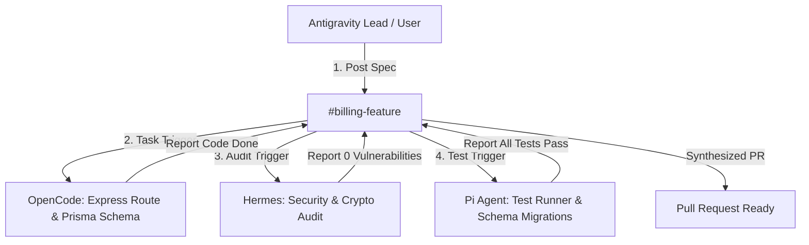

# 🌐 Real-World Multi-Agent Recipes & GitHub Patterns

This guide provides battle-tested recipes and workflows for coordinating heterogeneous AI agents (**Antigravity**, **OpenCode**, **Hermes Agent**, **Pi Coding Agent**, **Cursor**, **Devin**) in real-world software engineering scenarios.

---

## 1. 🏗️ Pattern A: Full-Stack Feature Swarm (Supervisor-Worker)

### The Real-World Problem:
When building a new full-stack feature (e.g. Stripe checkout + webhooks), doing everything sequentially in a single agent prompt leads to context dilution, forgotten edge cases, or missed cryptographic validations.

### The Solution:
Decompose the feature into specialized roles operating concurrently across a shared topic channel (`#billing-feature`):



### Executable Example:
Run the ready-to-use example:
```powershell
node examples/fullstack-feature-swarm.js
```

---

## 2. 🔍 Pattern B: Multi-Agent Pull Request Review Pipeline

### The Real-World Problem:
A single reviewer often overlooks niche security risks or API convention breaks.

### The Solution:
Dispatch parallel specialized review tasks whenever a PR diff is submitted:
1. **Hermes Agent**: Scans for OWASP Top 10, timing attacks, header injections, and cryptographic issues.
2. **OpenCode Agent**: Analyzes API contracts, error boundaries, and developer experience.
3. **Pi Agent / Runner**: Validates test coverage and regression impacts.

### Executable Example:
```powershell
node examples/github-pr-review-swarm.js
```

---

## 3. 📊 Pattern C: Real-Time SSE Observability Dashboard

Monitor all multi-agent messages, broadcasts, and topic channels live in your browser:

1. Start the Intercom HTTP & SSE Daemon:
   ```powershell
   intercom server
   ```
2. Open `examples/live-mesh-dashboard.html` in your browser.
3. Watch live message streams flow between agents in real time, with instant dispatch capabilities from the UI.

---

## 4. 🔀 Pattern D: Git Worktree Isolation for Parallel Agents

To prevent multiple agents working concurrently from clobbering each other's working directory files:

```powershell
# 1. Create isolated worktrees for each agent
git worktree add ../feature-backend feature/backend-api
git worktree add ../feature-security feature/security-audit

# 2. Run OpenCode in the backend worktree
intercom bridge --agent opencode -- "cd ../feature-backend; opencode"

# 3. Run Hermes in the security worktree
intercom bridge --agent hermes -- "cd ../feature-security; hermes chat"

# 4. Notify when ready to merge
intercom broadcast --from opencode --to "antigravity,hermes" --msg "Backend branch ready for review"
```

---

## 5. 🤖 Available Pre-Built Examples in Repository

| Example Script | Description |
| :--- | :--- |
| [`examples/fullstack-feature-swarm.js`](../examples/fullstack-feature-swarm.js) | Complete SaaS feature implementation workflow across Antigravity, OpenCode, Hermes, and Pi. |
| [`examples/github-pr-review-swarm.js`](../examples/github-pr-review-swarm.js) | Automated multi-agent code review pipeline generating structured GitHub markdown. |
| [`examples/live-mesh-dashboard.html`](../examples/live-mesh-dashboard.html) | Real-time web dashboard consuming the SSE event bus. |
